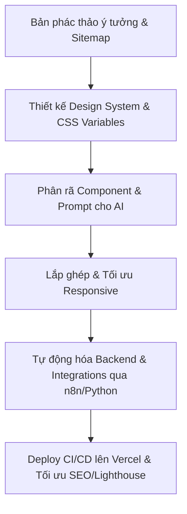

# 🚀 Kỹ Năng Xây Dựng Website Siêu Tốc Với AI (AI-Augmented Web Development)

> **"Từ ý tưởng đến sản phẩm chạy thực tế (Production-Ready) chỉ trong 3 giờ — Không cần Team, Tối ưu tối đa bằng AI."**

Hồ sơ năng lực này đúc kết toàn bộ phương pháp luận, tư duy thiết kế, bộ công nghệ (tech stack) và quy trình làm việc được tối ưu hóa để xây dựng các website vận hành hoàn chỉnh trong thời gian kỷ lục của **Phan Quang Vinh**.

---

## 📌 Tổng Quan Năng Lực (Competency Overview)

Sự giao thoa độc đáo giữa **Tư duy Quy trình (Process Mindset)** và **Tự động hóa qua AI (AI Automation)** tạo nên một năng lực triển khai sản phẩm web vượt trội về mặt tốc độ lẫn chất lượng:
*   **Hiệu suất vượt trội (10x Developer):** Rút ngắn thời gian phát triển từ 2-3 tuần xuống còn **3 giờ** cho một website hoàn thiện.
*   **Tích hợp sâu (All-in-One):** Tích hợp đầy đủ các cổng thanh toán tự động, hệ thống quản trị nội dung (CMS), hệ thống chăm sóc khách hàng (CRM), và Marketing Automation.
*   **Đề cao tính thẩm mỹ & Trải nghiệm (Aesthetic & UX):** Giao diện chuẩn phong cách hiện đại (Premium, Minimalist, Dark mode, Grid layout), responsive 100% trên các thiết bị.

---

## 🛠️ Bộ Công Nghệ Chiến Lược (Strategic Tech Stack)

Để đạt được tốc độ triển khai thần tốc mà vẫn đảm bảo tính tùy biến và hiệu năng tối đa, bộ công nghệ được lựa chọn cẩn thận:

| Lớp (Layer) | Công Nghệ Sử Dụng | Lý Do Lựa Chọn |
| :--- | :--- | :--- |
| **Core Frontend** | HTML5, Vanilla CSS / Tailwind CSS, JavaScript (ES6+) | Tối ưu hóa tốc độ tải trang tuyệt đối, dễ dàng kiểm soát bố cục và animations. |
| **Framework (Khi Scale)** | Next.js (App Router), TypeScript | Sử dụng khi hệ thống cần tối ưu SEO động, Server-Side Rendering (SSR) và cấu trúc component lớn. |
| **Tự Động Hóa & Backend** | n8n, Python, RESTful API | Xử lý dữ liệu ngầm, đồng bộ hóa lead, tự động gửi email và quản lý database không cần code backend cồng kềnh. |
| **Hạ Tầng & Deploy** | Git, GitHub / GitLab, Vercel | Thiết lập luồng CI/CD tự động. Tự động hóa việc phân phối qua CDN toàn cầu của Vercel với Clean URLs (`vercel.json`). |

---

## 💡 Phương Pháp Luận AI-Augmented Development (Quy Trình 3 Giờ)

Bí quyết để xây dựng một website hoàn chỉnh một mình trong 3 giờ nằm ở **phương pháp cộng tác với AI**:

### 1. Quy hoạch cấu trúc & Prompting chuyên nghiệp
*   **Tư duy System Architect:** Coi AI như một lập trình viên cao cấp. Đưa ra hướng dẫn mang tính cấu trúc thay vì yêu cầu AI viết bừa bãi.
*   **Context Control:** Giới hạn phạm vi ngữ cảnh cho AI bằng cách định nghĩa trước các quy tắc lập trình (ví dụ: viết Tailwind sạch, không mix thư viện ngoài, giữ code clean, định nghĩa kiểu dữ liệu rõ ràng).

### 2. Thiết kế hệ thống từ gốc (Design System First)
*   Trước khi viết bất kỳ component nào, định nghĩa ngay bộ biến CSS (`index.css` hoặc `variables` trong Tailwind) gồm:
    *   Hệ màu sắc (Primary, Secondary, Accent, Dark/Light Background).
    *   Hệ khoảng cách (Spacing scale - HSL tailored).
    *   Hệ font chữ và kích thước (Typography hierarchy - Google Fonts).
*   Giúp toàn bộ website đồng bộ về mặt thẩm mỹ và dễ dàng thay đổi giao diện (theme) chỉ trong 5 giây.

### 3. Phân rã Component & Ghép nối song song (Modular Architecture)
*   Tránh viết code monolith (nguyên khối). Chia nhỏ website thành các cấu trúc độc lập:
    *   `Layout`: Header, Navigation, Footer.
    *   `Sections`: Hero, About, Work, Blog, Contact.
*   Yêu cầu AI code từng khối riêng biệt rồi lắp ráp. Điều này giúp giảm thiểu lỗi cú pháp và tăng độ chính xác lên 95%.

---

## 🎨 Tư Duy Thiết Kế Đỉnh Cao (Visual Aesthetics & UX)

Một website chạy nhanh nhưng xấu là thất bại. Kỹ năng tạo website của Phan Quang Vinh luôn đề cao tiêu chuẩn thẩm mỹ cao cấp:
*   **Sử dụng Rich Aesthetics:** Phối hợp các dải màu tối sâu thẳm (như `#0a0a0a`) với các điểm nhấn (Accent color) rực rỡ nhưng tinh tế (như Indigo, Teal hoặc Amber).
*   **Micro-interactions:** 
    *   Hiệu ứng hover mềm mại trên các thẻ (`transition: transform 0.3s ease, border-color 0.3s ease`).
    *   Hiệu ứng Fade-up khi scroll trang sử dụng `IntersectionObserver` gọn nhẹ bằng Vanilla JS.
*   **Responsive Cực Hạn (Mobile-First):** Sử dụng linh hoạt CSS Grid và Flexbox. Đảm bảo mọi khối nội dung, hình ảnh avatar tự động co giãn và căn lề hoàn hảo trên iPhone, iPad lẫn màn hình Desktop siêu rộng.

---

## 📈 Tối Ưu Hóa SEO & Hiệu Năng (SEO & Performance Tuning)

Website được tối ưu hóa chuẩn SEO ngay từ dòng code đầu tiên để đảm bảo khả năng tiếp cận và thứ hạng tìm kiếm tốt nhất:
*   **Cấu Trúc Semantic HTML:** Chỉ sử dụng duy nhất một thẻ `<h1>` cho tiêu đề trang chính, kết hợp với các thẻ phân cấp `<section>`, `<article>`, `<header>`, `<footer>`.
*   **SEO Metadata & Open Graph (OG):** Khai báo đầy đủ thẻ meta mô tả (`description`), tiêu đề trang (`title`) và thẻ OG để khi chia sẻ liên kết lên mạng xã hội (Facebook, LinkedIn, Zalo) hình ảnh và nội dung hiển thị tối ưu nhất.
*   **Tối Ưu Tốc Độ Tải (Lighthouse Score > 95):**
    *   Nén và định dạng lại toàn bộ hình ảnh sang WebP.
    *   Sử dụng thuộc tính `loading="lazy"` cho ảnh dưới màn hình đầu tiên (below the fold).
    *   Không cài đặt các thư viện JS nặng nề khi không cần thiết.

---

## ⚙️ Tự Động Hóa Hệ Sinh Thái & Các Tính Năng Cao Cấp

Điểm tạo nên sự khác biệt của sản phẩm là khả năng kết nối và vận hành tự động:
*   **Hỗ trợ Song ngữ (Multi-language Toggle):** Thiết lập cơ chế chuyển đổi ngôn ngữ Anh - Việt siêu tốc trên client sử dụng các thuộc tính `data-vi` / `data-en` và lưu lựa chọn người dùng vào `localStorage` của trình duyệt.
*   **Marketing & CRM Automation:**
    *   Liên kết biểu mẫu (Contact Form) trực tiếp với webhook của **n8n**.
    *   Tự động bắn lead về hệ thống CRM chăm sóc khách hàng, gửi email xác nhận cá nhân hóa ngay lập tức.
*   **Hệ thống Báo cáo Tự động hóa:** Kết nối website với data pipeline (viết bằng Python) để tự động xuất và cung cấp tài liệu cho người dùng dựa trên tương tác trên web.

---

## 🏆 Case Study Thực Tế: phanquangvinh.com

*   **Đầu vào:** Ý tưởng về một trang Portfolio kết hợp Lifestyle blog cá nhân.
*   **Quá trình triển khai:** 
    1.  Setup Boilerplate và thiết kế Layout tổng thể trong 30 phút đầu.
    2.  Dùng AI để sinh mã các component chính xác dựa trên CSS Variables đã thiết kế sẵn.
    3.  Lồng ghép tính năng Song ngữ (VI/EN) bằng Vanilla JS trong 20 phút.
    4.  Cấu hình Git và Deploy Vercel, cài đặt tên miền `phanquangvinh.com`.
*   **Kết quả:** Một website đa trang chỉn chu, phản hồi mượt mà, sẵn sàng phục vụ hàng ngàn người truy cập chỉ sau **3 giờ** làm việc độc lập.

---

*Cập nhật lần cuối: Tháng 5/2026 | Bản quyền thuộc về Phan Quang Vinh*
